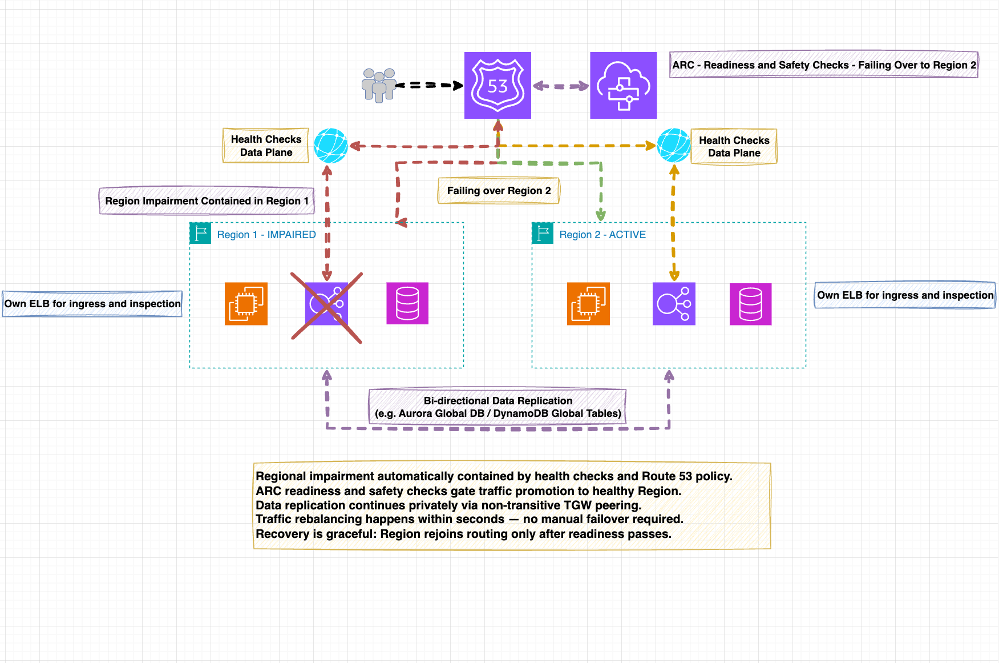

# Cloud Networking and Resilience: Designing Scalable, Fault-Tolerant, and Highly-Available Cloud Network Architectures

## 📘 About This Repository
This repository accompanies the Apress book:

- **_Cloud Networking and Resilience: Designing Scalable, Fault-Tolerant, and Highly-Available Cloud Network Architectures_**
- **(Apress, 2026) by Cristian Critelli**  
- **ISBN: 979-8-8688-2435-7**
- **Published by: Apress Media, LLC, New York, NY**  
[www.apress.com](https://www.apress.com)

---

### 🧭 Overview

This repository serves as the official companion resource for the book *Cloud Networking and Resilience*, providing all the supporting materials referenced throughout its chapters.  
It is organized to mirror the book’s structure and includes practical assets that allow readers, architects, and engineers to reproduce and extend the concepts demonstrated in the text.

Each chapter explores how modern cloud network architectures can be designed, operated, and tested for **resilience**, **availability**, and **fault tolerance** — with a focus on AWS as the reference implementation.

---

### 💬 Author’s Note

This project is dedicated to **Ade (2017 – 2022)** — my beloved Bengal cat, brother, son, dearest friend, and constant companion.  

Through his quiet strength, unwavering loyalty, and gentle presence, he taught me what resilience truly means in life.  
In my work, I design for resilience every day — and it felt only natural to honor him here, with his face on this book,  
so that everyone who reads it sees the inspiration behind both my life’s work and this journey.  

The repository will continue to evolve as new chapters, updates, and resources are released,  
ensuring that the book’s examples remain current with the latest advancements in cloud networking and AWS services.

---

### 📗 About the Book

*Cloud Networking and Resilience* is a deep technical guide to designing and operating reliable cloud network architectures at scale.  
It bridges foundational networking principles with modern cloud-native constructs — from **DNS resilience** and **BGP engineering** to **multi-region failover**, **automation**, and **chaos testing**.

The book spans **nine chapters**, grouped across three major sections:

1. **Foundations of Cloud Resilience** – Concepts, definitions, and network fundamentals (Ch. 1–3)  
2. **Designing Resilient Network Architectures** – Techniques and architectures across layers (Ch. 4–7)  
3. **Automating and Future-Proofing Resilience** – Observability, chaos, AI-driven fault detection, and the future of cloud networking (Ch. 8–9)

## 📚 Table of Contents

| Chapter | Title |
|:--|:--|
| **Chapter 1** | What is Resilience in the Cloud era|
| **Chapter 2** | Fundamentals of Cloud Networking and Network Topologies |
| **Chapter 3** | DNS Fundamentals |
| **Chapter 4** | Resilient DNS Architectures and Techniques |
| **Chapter 5** | Implementing Resilience Throughout the OSI Model with AWS Examples |
| **Chapter 6** | Building Network Isolation with Cell-Based Architectures, Availability Zones and Regions |
| **Chapter 7** | Traffic Engineering for Cloud Resilience and Performance |
| **Chapter 8** | Operational Resilience and Disaster Recovery |
| **Chapter 9** | The Next Decade of Cloud Resilience |

---

### 🧩 Companion Material

- **Draw.io Diagrams:** Editable architectural diagrams used throughout the book  
  → [📂 Chapter Diagram ZIPs](#downloadable-chapter-diagram-packs)
- **Image Packs:** PNG exports of every figure  
  → [🖼️ Chapter Image ZIPs](#chapter-image-packs)
- **Code Samples:** Route 53 policies, BGP configurations, and automation examples (to be released gradually)

---

### 🗂️ Structure
```
cloud-networking-resilience/
├── architectural-diagrams/   → Architecture diagrams (draw.io)
├── chapters/                 → Markdown notes and excerpts per chapter
├── code/                     → Configurations, JSON templates, scripts
├── docs/                     → Additional documentation or datasets
└── images/                   → Architecture diagrams (PNG)
```

---

## 🧩 Examples Included
- **DNS & Routing:** Route 53 failover JSONs, latency-based routing configs  
- **BGP Traffic Engineering:** Prepending, MED, and local-preference examples  
- **AWS Direct Connect & VPN:** Hybrid high-resilience reference models  
- **Resilience Automation:** Lambda failover scripts and ARC readiness checks  

---

## 🖼️ Images & Diagrams

- Each figure referenced in the book is stored in the `/images/` folder, each under their own chapters, for example...   

<p align="center">
  
</p>

---

<h2 id="chapter-image-packs">🖼️ Chapter Image Packs</h2>

All images are also provided as ZIPs.  
Click to download, or browse to `/images/` and right-click → **Save link as…**.

| Chapter | Download |
|:--|:--|
| **Chapter 1** | [📦 chapter-1-images.zip](https://github.com/crcritel/cloud-networking-resilience/raw/main/images/chapter-1/chapter-1-images.zip) |
| **Chapter 2** | [📦 chapter-2-images.zip](https://github.com/crcritel/cloud-networking-resilience/raw/main/images/chapter-2/chapter-2-images.zip) |
| **Chapter 3** | [📦 chapter-3-images.zip](https://github.com/crcritel/cloud-networking-resilience/raw/main/images/chapter-3/chapter-3-images.zip) |
| **Chapter 4** | [📦 chapter-4-images.zip](https://github.com/crcritel/cloud-networking-resilience/raw/main/images/chapter-4/chapter-4-images.zip) |
| **Chapter 5** | [📦 chapter-5-images.zip](https://github.com/crcritel/cloud-networking-resilience/raw/main/images/chapter-5/chapter-5-images.zip) |
| **Chapter 6** | [📦 chapter-6-images.zip](https://github.com/crcritel/cloud-networking-resilience/raw/main/images/chapter-6/chapter-6-images.zip) |
| **Chapter 7** | [📦 chapter-7-images.zip](https://github.com/crcritel/cloud-networking-resilience/raw/main/images/chapter-7/chapter-7-images.zip) |
| **Chapter 8** | [📦 chapter-8-images.zip](https://github.com/crcritel/cloud-networking-resilience/raw/main/images/chapter-8/chapter-8-images.zip) |
| **Chapter 9** | [📦 chapter-9-images.zip](https://github.com/crcritel/cloud-networking-resilience/raw/main/images/chapter-9/chapter-9-images.zip) |

> If your browser tries to open the ZIP, right-click the link and choose **Save link as…**.

<h2 id="downloadable-chapter-diagram-packs">💾 Downloadable Chapter Diagram Packs</h2>

All architectural diagrams are provided as ZIPs (each contains the chapter’s .drawio sources).  
Click to download, or browse to `/architectural-diagrams/` and right-click → **Save link as…**.

| Chapter | Download |
|:--|:--|
| **Chapter 1–2–3** | [📦 chapter-1-2-3-draw.io.zip](https://github.com/crcritel/cloud-networking-resilience/raw/main/architectural-diagrams/chapter-1-2-3/chapter-1-2-3-draw.io.zip) |
| **Chapter 4** | [📦 chapter-4-draw.io.zip](https://github.com/crcritel/cloud-networking-resilience/raw/main/architectural-diagrams/chapter-4/chapter-4-draw.io.zip) |
| **Chapter 5** | [📦 chapter-5-draw.io.zip](https://github.com/crcritel/cloud-networking-resilience/raw/main/architectural-diagrams/chapter-5/chapter-5-draw.io.zip) |
| **Chapter 6** | [📦 chapter-6-draw.io.zip](https://github.com/crcritel/cloud-networking-resilience/raw/main/architectural-diagrams/chapter-6/chapter-6-draw.io.zip) |
| **Chapter 7** | [📦 chapter-7-draw.io.zip](https://github.com/crcritel/cloud-networking-resilience/raw/main/architectural-diagrams/chapter-7/chapter-7-draw.io.zip) |
| **Chapter 8** | [📦 chapter-8-draw.io.zip](https://github.com/crcritel/cloud-networking-resilience/raw/main/architectural-diagrams/chapter-8/chapter-8-draw.io.zip) |
| **Chapter 9** | [📦 chapter-9-draw.io.zip](https://github.com/crcritel/cloud-networking-resilience/raw/main/architectural-diagrams/chapter-9/chapter-9-draw.io.zip) |

> If your browser tries to open the ZIP, right-click the link and choose **Save link as…**.

---

📚 **Citation**

If you reference or reuse materials from this repository, please credit:

> *Critelli, Cristian.* “Cloud Networking and Resilience: Designing Scalable, Fault-Tolerant, and Highly-Available Cloud Network Architectures.” Apress Media, LLC, 2026.  
> Companion repository available at [github.com/crcritel/cloud-networking-resilience](https://github.com/crcritel/cloud-networking-resilience)

Copyright © 2026 Cristian Critelli. All rights reserved.  
This repository is intended as a companion for the book *Cloud Networking and Resilience* (Apress 2026).  
You may view and reference this material for educational and non-commercial purposes only.  
Redistribution or modification without permission from the author or Apress Media LLC is prohibited.
